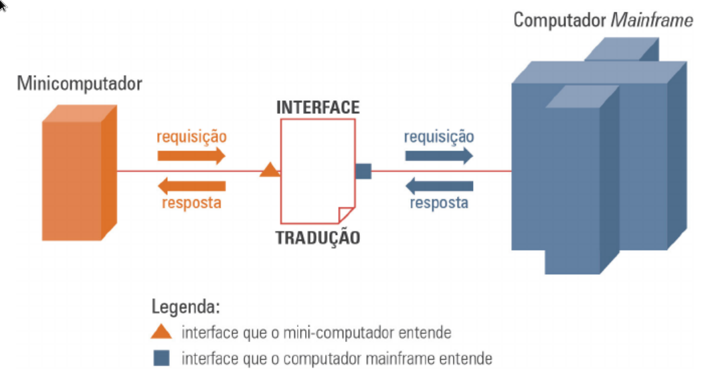

# <!-- fit --> Programação Orientada a Serviços

### Prof. Diego Cirilo

**Aula 03**: Arquiteturas Monolíticas

---

# Arquiteturas Monolíticas

- Metodologia básica de desenvolvimento
- Sem problemas para sistemas simples
- Sistemas complexos...
- Reflexo do mercado na época.

---

---
# Computação Distribuída
- Sistemas grandes: dividir para conquistar
- Melhor alocação de recursos
- Confiabilidade
- Manutenção, etc.

---

---
# Interfaces
- Problemas de interoperabilidade
- Padrões proprietários
- Desenvolvimento *on-demand*
- Baixo reuso

---

---
# Alto acoplamento
- Sistemas desenvolvidos em conjunto
- O funcionamento de cada elemento depende dos outros
- Protecionismo?
- Alto custo.

---
# Orientação a objetos
- Reuso
- Padrões
- Melhor organização do código
- Eficiência/Baixo custo
- Problema: o reuso dependia da linguagem

---
# Arquitetura Cliente-Servidor
- Advento da internet
- Possibilidade de "reuso" em diferentes linguagens
- Só funciona com padrões abertos...

---

---
# Padrões
- Permitem a interoperabilidade
- Grupos industriais colaborativos
- W3C - *World Wide Web Consortium*
- Tim Berners-Lee
- HTTP/HTML
- Funciona em outras áreas: tomadas, USB-C, Bluetooth, P2, etc.

---
# Exemplos
- HTTP: *Hyper Text Transfer Protocol*
- XML: *eXtensible Markup Language*
- SOAP: *Simple Object Access Protocol*
- WSDL: *Web Services Description Language*
- UDDI: *Universal Description, Discovery and Integration*
- REST: *REpresentational State Transfer*

---
# <!--fit--> Dúvidas? 🤔

