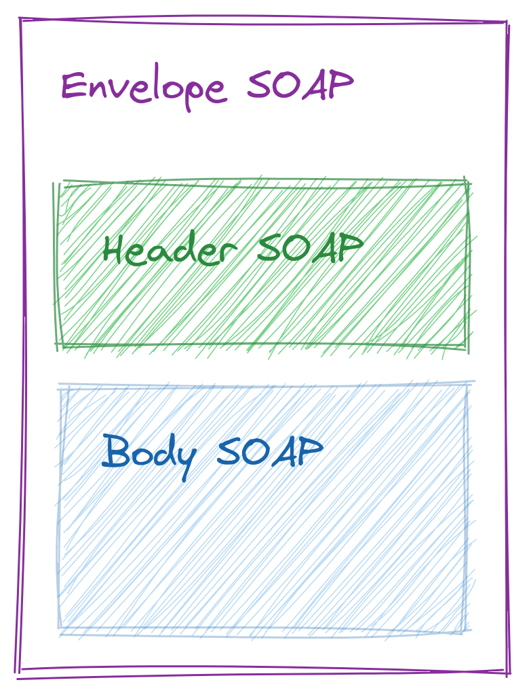

<style>
img {
  display: block;
  margin: 0 auto;
}
</style>

# <!-- fit --> Programação Orientada a Serviços

### Prof. Diego Cirilo

**Aula 03**: APIs SOAP

---
# SOAP
- *Simple Object Access Protocol*
- Usualmente XML sobre HTTP
- Características:
    - Extensibilidade
    - Neutralidade
    - Independência

---
# SOAP

- Envelope que define a estrutura de mensagens
- Conjunto de regras de *encoding* para expressar os tipos de dados
- Convenção para expressar as chamadas e respostas

---
# Elementos da mensagem SOAP
<style scoped>
table {
  font-size: 18px;
}
</style>

| Elemento  | Descrição                                                | Obrigatório? |
|-----------|----------------------------------------------------------|--------------|
| Envelope  | Identifica o documento XML como uma mensagem SOAP        | Sim          |
| Cabeçalho | Contém informação de cabeçalho (*header*)                | Não          |
| Corpo     | Informações de chamada e retorno (*body*)                | Sim          |
| Falha     | Informações de erros durante o processamento da mensagem | Não          |



---
# WSDL
- *Web Services Description Language*
- Baseado em XML
- Usado para descrever um serviço SOAP

---
# XML e Python
- `untangle`
- `xmltodict`

---
# Consumindo SOAP com Python
```python
import requests
# SOAP request URL
url = "http://webservices.oorsprong.org/websamples.countryinfo/CountryInfoService.wso"

# structured XML
payload = """<?xml version=\"1.0\" encoding=\"utf-8\"?>
			<soap:Envelope xmlns:soap=\"http://schemas.xmlsoap.org/soap/envelope/\">
				<soap:Body>
					<CountryIntPhoneCode xmlns=\"http://www.oorsprong.org/websamples.countryinfo\">
						<sCountryISOCode>IN</sCountryISOCode>
					</CountryIntPhoneCode>
				</soap:Body>
			</soap:Envelope>"""
# headers
headers = {
	'Content-Type': 'text/xml; charset=utf-8'
}
# POST request
response = requests.request("POST", url, headers=headers, data=payload)

# prints the response
print(response.text)
print(response)
```

---
# Zeep
```python
import zeep

# set the WSDL URL
wsdl_url = "http://webservices.oorsprong.org/websamples.countryinfo/CountryInfoService.wso?WSDL"

# set method URL
method_url = "http://webservices.oorsprong.org/websamples.countryinfo/CountryIntPhoneCode"

# set service URL
service_url = "http://webservices.oorsprong.org/websamples.countryinfo/CountryInfoService.wso"

# create the header element
header = zeep.xsd.Element(
	"Header",
	zeep.xsd.ComplexType(
		[
			zeep.xsd.Element(
				"{http://www.w3.org/2005/08/addressing}Action", zeep.xsd.String()
			),
			zeep.xsd.Element(
				"{http://www.w3.org/2005/08/addressing}To", zeep.xsd.String()
			),
		]
	),
)
# set the header value from header element
header_value = header(Action=method_url, To=service_url)

# initialize zeep client
client = zeep.Client(wsdl=wsdl_url)

# set country code for India
country_code = "IN"

# make the service call
result = client.service.CountryIntPhoneCode(
	sCountryISOCode=country_code,
	_soapheaders=[header_value]
)
# print the result
print(f"Phone Code for {country_code} is {result}")

# set country code for United States
country_code = "US"

# make the service call
result = client.service.CountryIntPhoneCode(
	sCountryISOCode=country_code,
	_soapheaders=[header_value]
)

# print the result
print(f"Phone Code for {country_code} is {result}")
print(response)
```

---
# <!--fit--> Dúvidas? 🤔
