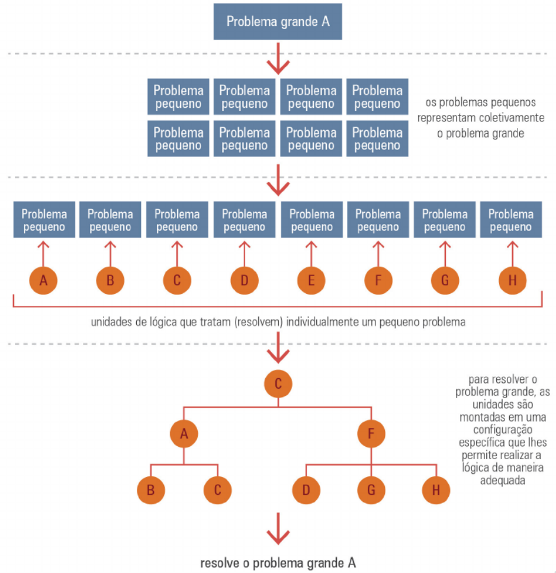

# <!-- fit --> Programação Orientada a Serviços

### Prof. Diego Cirilo

**Aula 04**: Princípios da SOA

---

# Princípios de projeto SOA
- Contrato de serviço padronizado
- Baixo acoplamento
- Abstração
- Reusabilidade
- Autonomia
- Ausência de estado (*stateless*)
- Visibilidade
- Composição

---
# Contrato de serviço padronizado
- Definição da interface
- O que o cliente precisa fornecer
- O que o cliente pode esperar
- Detalhes semânticos (significados)
- Sem o contrato é impossível existir serviços.

---
# Baixo acoplamento
- Medida de dependência entre serviços
- Permite evolução independente da implementação
- Menor impacto para os clientes no caso de updates/modificações
- Troca de mensagens e uso de padrões

---
# Abstração
- O serviço é uma caixa preta para o cliente
- Ele deve conhecer bem as interfaces (contrato)
- Já a implementação é indiferente
- O nível de abstração influencia a granularidade e o custo
    - Mais abstrato: serviço mais completo e caro
    - Menos abstrato: serviços mais específicos

---

---
# Reusabilidade
- Um serviço bem planejado é útil em mais de uma situação
- Quanto maior a abstração (menor granularidade), mais difícil o reuso
    - Ex. Gestão de clientes *vs.* cadastro de clientes
- Um dos princípios mais importantes

---

---
# Autonomia
- Um serviço deve ter autonomia de ser executado individualmente
- Controle sobre recursos na execução

---
# Ausência de estado (*stateless*)
- A operação do serviço não deve depender de estado
- Cada interação dever ser única, não depende de um estado anterior

---
# Visibilidade
- O serviço deve ser visível
- Descrição
- Diretório/Catálogo
- Metadata

---
# Composição
- Serviços podem ser combinados
- Divisão de problemas grandes em unidades reutilizáveis
- Permite o reuso compondo serviços mais complexos

---

---
# <!--fit--> Dúvidas? 🤔

